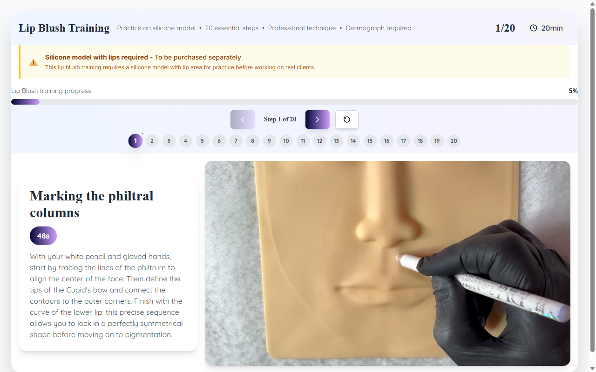

# Technique Avancée — Lip Blush EN

**Course:** Lip Blush (EN)  
**Slide:** 7  
**Live URL:** https://dfghjh.edtechiecorp.com  
**Stack:** Next.js · Tailwind CSS · TypeScript · GitHub Pages  

## What this slide does

Covers the core lip blush pigmentation technique in English, including needle selection, stroke direction, and colour layering methods for achieving a natural flush effect. The slide walks practitioners through technique execution step by step, with emphasis on symmetry and gradual pigment build-up to avoid overworking the skin. This is the primary technique content for the English-language lip blush course.

## Screenshot

## Usage

This slide is embedded as an iframe inside Coassemble at the live URL above. DNS is managed via Cloudflare (`edtechiecorp.com`). To update the slide, push to the `main` branch — GitHub Actions will rebuild and redeploy automatically.
